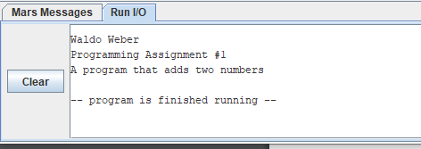
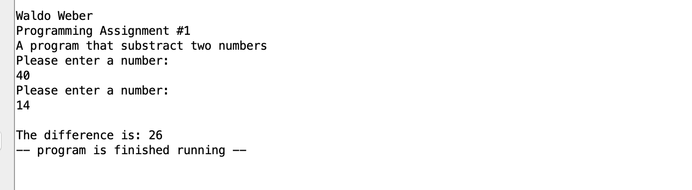
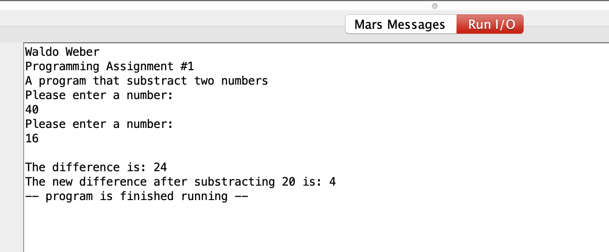

# Module 2: Assembly Language Basics

- [Module 2: Assembly Language Basics](#module-2-assembly-language-basics)
	- [Task 0](#task-0)
	- [Purpose](#purpose)
	- [Skills and Knowledge](#skills-and-knowledge)
	- [Taks 1: Print User Information](#taks-1-print-user-information)
		- [Sample Output Task 1](#sample-output-task-1)
	- [Task 2: Take user input](#task-2-take-user-input)
		- [Sample Output Task 2](#sample-output-task-2)
	- [Task 3: Substract an immediate value](#task-3-substract-an-immediate-value)
		- [Sample Output Task 3](#sample-output-task-3)
	- [Submission Checklist](#submission-checklist)
	- [Other Resources](#other-resources)
  
## Task 0

Use the `la` folder of this project to save all the practice programs we discussed in the video lectures. If you need to review the concepts, follow the [LA README](la/README.md)

## Purpose

This is an introductory assignment. The purpose of this assignment in to help you understand how to submit the files for this course and to practice the basics of the MIPS language.

## Skills and Knowledge

The goal of this lab is to get some initial experience programming in MIPS assembly language. Specifically, by the end of this assignment, you should feel comfortable:

1. Manipulating registers
2. Doing basic integer arithmetic
3. Defining constants and variables in data memory
4. Reading from and writing to data memory
5. Using the system call interface to perform I/O

This lab will also help you to become familiar with the following important content knowledge in CS:

- Working in a RISC architecture
- Review basic programming concepts

## Taks 1: Print User Information

Your first task is to print a message that includes `your name, assignment number, and a brief description of the program`.

Begin working in the file template (`ca.asm`) provided in the `ca` folder.

```mips
# Data for the program goes here
.data

# Code goes here
.text
main:
 
 li $v0, 10  # 10 is the exit program syscall
 syscall   # execute call

## end of ca.asm
```

In the `.data` directive, declare a string with the information requested: name, assignment, and file description. For example, `Waldo` will begin with the following code:

```mips
.data
name: .asciiz "Waldo Wildcat"

.text
main:
    # ...
 la $a0, name # load address of name string into $a0
 li $v0, 4  # 4 is the print_string() syscall
 syscall   # execute call
    # ...
```

Now, repeat the previous step and display two more strings:

- `hw` label for your assignment number: "Program Assignment #1"
- `info` label for your assignment information: "A program that adds two numbers"

Display all three strings on the screen

### Sample Output Task 1



## Task 2: Take user input

Your next task is to add code to compute and print the substraction of two numbers specified at runtime by the user.

Use the following registers to hold your input values

```mips
# Registers used: 
#      $t0 - used to hold the first number.
#      $t1 - used to hold the second number.
#      $t2 - used to hold the difference of $t0 and $t1.
```

In your `main` procedure, use the `system call #5` to read an integer, then save/move the return value into a temporary register. In order to not confuse users, you will display a string asking the question to enter a number

```mips
##...
question1: .asciiz "Please enter a number: \n" 
##...
 la $a0, question1  # load the address of q1 string into $a0
 li $v0, 4  # 4 is the print_string() syscall
 syscall   # execute call
 
 li $v0, 5  # load syscall read_int() into $v0
 syscall   # execute call
 move $t0, $v0 # move the number read into $t0
```

Now, repeat the steps to read the second number into `$t1`. Make sure you ask the question again. You may use the same `question1` string label you declared before.

Next, using the `sub` instruction, compute the difference of the values in `$t0` and `$t1` and store it in `$t2`.

Finally, display the value of `$t2`. To make the output more meaningful, declare another string label called `difference` and print it before the `$t2` value

```mips
##...
difference: .asciiz "\nThe difference is: "

##...
 la $a0, sum  # load the address of sum string into $a0
 li $v0, 4  # 4 is the print_string() syscall
 syscall   # execute call

 move $a0, $t2 # move the number to print into $a0.
 li $v0, 1  # load the syscall print_int() into $v0
 syscall   # execute call
```

### Sample Output Task 2



## Task 3: Substract an immediate value

The final task if to subtract the number `20` to your `$t2` register. For this use the sub immediate (`subi`) instruction to subtract 20 to the current value of `$t2` and store it in `$t3`. Once again, you will display a new string before displaying your result.

Remember to document your register usage.

```mips
# Registers used: 
##...
#      $t3 - used to hold the difference of $t2 and 20.
##...
diff_msg_2: .asciiz "\nThe new difference after subtracting 20 is: " 
##...
```

### Sample Output Task 3



## Submission Checklist

- [ ] Save my practice programs (Task 0)
- [ ] Complete Task 0, 1, 2, and 3.
- [ ] Save and `commit` my code in github desktop
- [ ] `Push` the code to github.com
- [ ] Uploaded video of code walkthrough  in `Canvas` and showing a demo of the program.
- [ ] Add your github repo as a comment to your assignment in `Canvas`.

## Other Resources

For more information go to [How to page](HOWTO.md)
